# Esperanza de vida, cuantos años tendremos que soportar esta vida tan perra. 

La esperanza de vida, es aquel indicador que nos da una valoración de cuántos años va a tener presencia consciente un ser humano acabado de nacer. 

Según la bibliografía existente, la esperanza de vida actua de manera diferente para cada país según sus condiciones socioeconómicas, por ejemplo, Babaie, M. (2020) nos comenta que en los países en vías de desarrollo el efecto de gasto en educación y en salud es mucho mayor que en los países desarrollados debido que el gasto en los países en desarrollo suele ser bastante bajo, por lo que el aumento de una de estas variables suele tener un mayor impacto en nuestra variable dependiente. 

Por otra parte, Wirayuda, A. A. B., & Chan, M. F. (2021) concluyen que las varibales que tienen un mayor efecto en la esperanza de vida son: EL PIB, el índice de GINI (desigualdad), la tasa de desempleo, la tasa de inflación y el nivel de ingresos. Hay que decir que este estudio fue llevado a cabo en países árabes por lo que podría no replicarse para otros países. 

Finalmente, en un estudio de 136 ciudades entre 2002 y 2010 Miles, D. (2023) llega a la conlcusión de que los factores que afectan de manera negativa a la espranza de vida son el desempleo y la inflación, mientras que los que afectan positivamente son el ingreso nacional bruto y la formación bruta de capital. Añadiendo que la urbanidad parece ser la principal causa social de mortalidad. 


Con todo esto que hemos comentado anteriormente, llega la hora de presentar:\


# Variables a tener en cuenta

1. **Esperanza de vida**: ya la conocemos

2. **CO2 per cápita**: Es un factor que no he visto que se tenga en cuenta en la literatura existente y, personalmente creo que es interesante observar si realmente, en estos últimos años donde el calentamiento global es un tema candente y tenemos macrociudades con nubes de contaminación en el aire tiene algún tipo de efecto en la longevidad de las personas del país. 

3. **Densidad de población**: A parte que es un estrés vivir con muchos lugares masificados, considero que puede ser un indicador interesante para ver cómo afecta la gentrificación a la salud de las personas. 

4. **Desempleo**: Hemos visto en la literatura que es un indicador a tener en cuenta por lo que también lo añadiremos al modelo. 

5. **Gasto público en educación**: Dentro de los gastos de la administración pública se ha tenido en cuenta la educación. 

6. **Gasto público en salud**: El otro gasto público que se ha tenido en cuenta para el modelo, comprobaremos si realmente tiene un efecto en la longevidad de las personas.

7. **PIB per cápita**: Un indicador bastante mencionado en la literatura que considero necesario a tener en cuenta.

8. **Percepción de la corrupción**: Me ha parecido una variable interesante a tener en cuenta, estudiaremos si las malas prácticas de los gobiernos tienen efecto en la salud de sus ciudadanos

9. **Suicidios x 100k hab.**: Al final si estudiamos esperanza de vida tenemos que tener en cuenta causas que puedan aumentar la mortalidad, en estos momentos de visibilización de la salud mental, comprobaremos si es un indicador suficientemente significativo como para poder afectar a la esperanza de vida de un país. 

10. **Homicidios x 100k hab.**: De igual manera que comprobamos con los suicidios, añadimos también los homicidios. 

11. **Indice mundial de la felicidad**: No todo iba a ser negativo, comprobaremos si una población feliz tiene tendencia a vivir más.

12. **Natalidad & fecundidad**: De estas dos variables que, spolier, tienen un correlación casi perfecta porque al final explican lo mismo de diferente manera, nos quedarmos con la natalidad porque creo que "el % de nuevas personas en la sociedad que proceden de fecundaciones por año" puede explicar mejor nuestra variable dependiente. 

13. **Indice de GINI**: Menciado también en la literatura como uno de los principales indicadores que explican el modelo, lo añadimos también. 


# Extracción de los datos

Para genera mi base de datos, busqué diferentes páginas que tuvieran información sobre estos indicadores macroeconómicos y no solo que tuvieran información sino que estuviera completa y pueda sacar una cantidad de datos considerable. 

Aquí debo dar las gracias a mis amigos de\
\
concretamente al apartado de Datos Macro, una recopilación de los diferentes datos macroeconomicos de los paises del mundo de 1960 al 2023. 

Para mi base de datos, he recogido información de 1990 hasta el 2020 para 191 países (puede que en algunos años sean menos)

Para ello, se han ido escrapeando las URLs de esta web que contenían la información deseada con este código:
```
anos = list(range(1990, 2021))
df_iterados = []
for i in anos: 
    
    url = f'https://datosmacro.expansion.com/demografia/homicidios?anio={str(i)}'
    print(url)
    response = requests.get(url)
    print(response.status_code)
    soup = BeautifulSoup(response.content, "html.parser")
    tabla = soup.find_all(class_ = 'table')
    tabla_html = str(tabla)
    soup = BeautifulSoup(tabla_html, 'html.parser')
    filas = soup.find_all('tr') 
    
    if i == 1990:
        pais = []
        dato = []
        year = []
        for fila in filas:
            celdas = fila.find_all('td')
            if len(celdas) >= 4:
                nombre_pais = celdas[0].text.strip()
                pais.append(nombre_pais)

                ano = i
                year.append(int(ano))

                numero_bruto = celdas[-2].text.strip()
                if len(numero_bruto) >0:
                    numero = numero_bruto
                else:
                    numero = np.NAN
                dato.append(numero)
    else:
        pais = []
        dato = []
        year = []
        for fila in filas:
            celdas = fila.find_all('td')
            if len(celdas) >= 4:
                nombre_pais = celdas[0].text.strip()
                pais.append(nombre_pais)

                ano = celdas[1].text.strip()
                year.append(int(ano))

                numero_bruto = celdas[-2].text.strip()
                if len(numero_bruto) >0:
                    numero = numero_bruto
                else:
                    numero = np.NAN
                dato.append(numero)
                
    data = {'pais':pais, 'year': year, 'homicidios':dato}
    df1 = pd.DataFrame(data)
    df_resultante = df1
    df_iterados.append(df_resultante)
    
df1 = pd.concat(df_iterados, ignore_index=True)
```
Resumiendo: Iteramos sobre los años que queremos (guardados en la lista anos), como la URL tiene un parámtero para definir el año simplemente lo substituimos por el item de la lista en questión. 

La información que necesitamos, para todas las variables, está en una tabla con clase 'table'. Por alguna razón no me detectaba que esta tabla estuviera escrita en JS por lo que la pasé a str y luego lo convertí en una soup. Milagrosamente funcionó así que no volví a tocar esa parte de código.

En la tabla, nos interesaba tener todas las filas de la misma. Por lo que guardamos toda la información que esté entre '<tr\>'. 

Pero dentro de estas filas, lo que realmente necesitamos es el dato, por lo que debemos buscar la celda, que en este caso la información se almacena entre '<td\>'

iteramos sobre las filas y vamos guardando los valores de las celdas según nos interese. Por norma general el páis está en la posición [0] y el dato que nos interesa en la posición [-2] pero de esto me enteré tarde y me la pasé contando columnas...

En esta página, cuando los datos son todos del mismo año, no ponen columna fecha, pero cuando hay datos que no están actualizados al año ponen los últimos datos disponibles, por lo que tuve que hacer un IF para cuando exista la columna fecha y cuando no. 

La base de datos quedó tal que así 

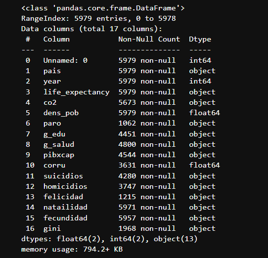\
Como podemos ver, en los indices de paro, felicidad y Gini hay muchos nulos (+60%)... 

Considero que no tengo la información suficiente como para tenerlas en cuenta así que las dropeo. 

Despues de la matanza de columnas nos queda el dataframe tal que así:\
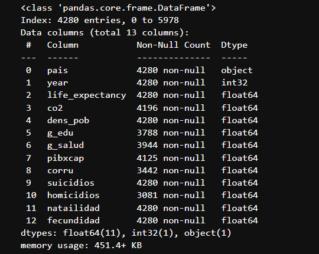\
Homicidios y Corrupción aun siguen teniendo un gran porcentaje de nulos (20%) pero correremos el riesgo de mantenerlas. 

# Imputación de nulos
He decidido imputar los nulos agrupando mis datos según el continente en el que se encuentra el país y el año. Así creo que puedo llegar a obtener una valor más fiable que si imputo solo por media, media por año o media por país. Dado que los valores de una año a otro son bastante variables. 

# Correlaciones

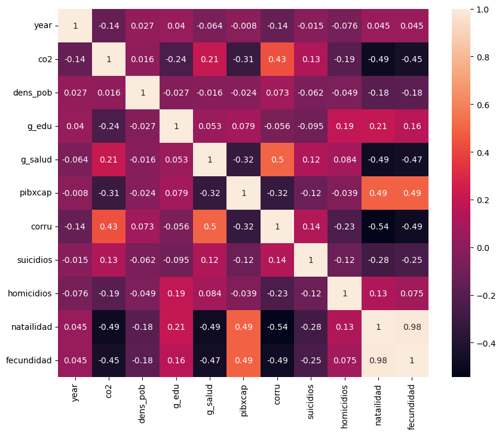\
Las únicas variables que vemos muy correlacionadas son la natalidad y fecundidad. De las demás variables no se observa que ninguna esté muy correlacionada con otra.

# Distribución de las variables

Empezamos con el **CO2 per cápita**:

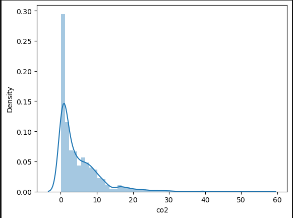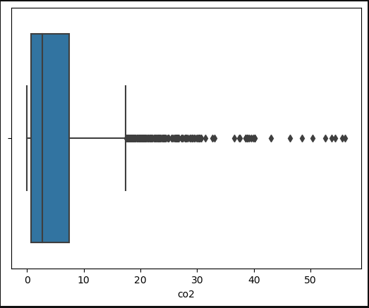\
Aplicamos logaritmo a la variable y nos queda una distribución así: 

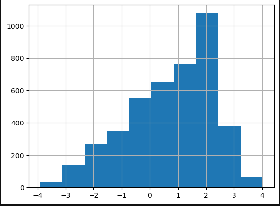
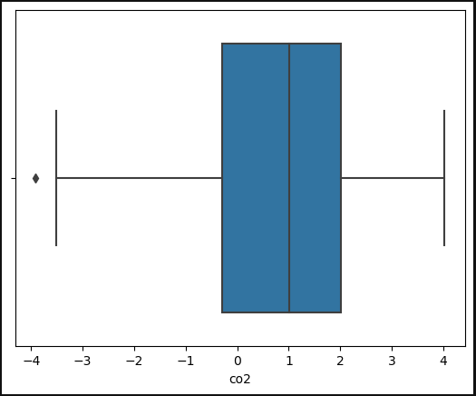

Con pocos outliers, así que dejaremos la variable así como está. 


La **densidad de población** presenta una distribución similar a la de CO2 por lo que haremos lo mismo: Aplicaremos LOG\
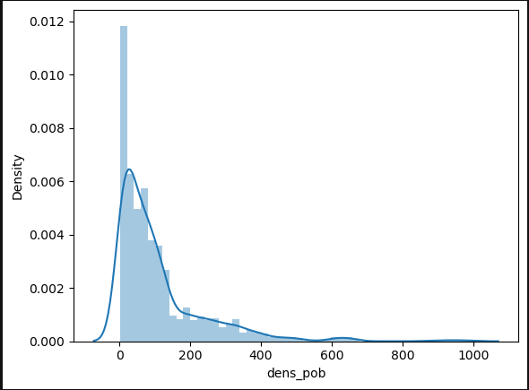

Nos queda una distribución más o menos centrada con algunos outliers por debajo que dejaremos que se queden en el modelo.\
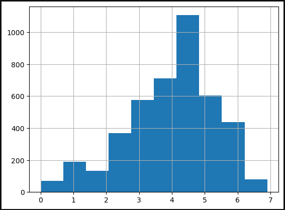
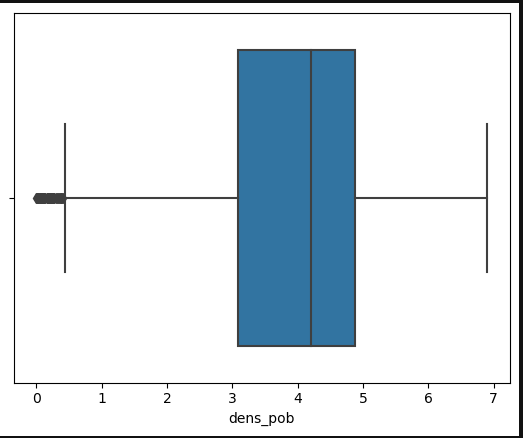

Para el **gasto en educación** solo recortaremos los oultilers de la derecha, la distribución ya esta bastante centrada:\
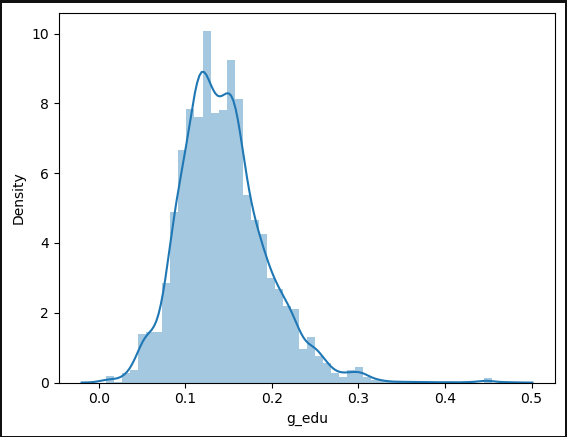

Para el **Gasto en salud** aplicaremos la misma metodología que para el gasto en educación:\
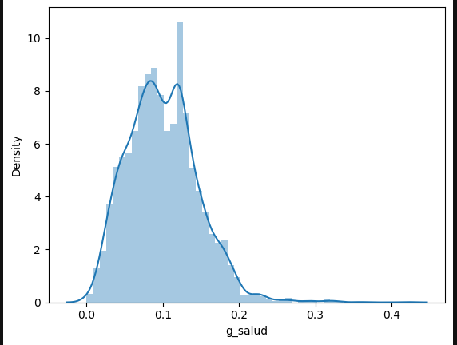

El **PIB x cápita** es una de mis variables duda, porque presenta un distribución muy skewed hacia la derecha:\
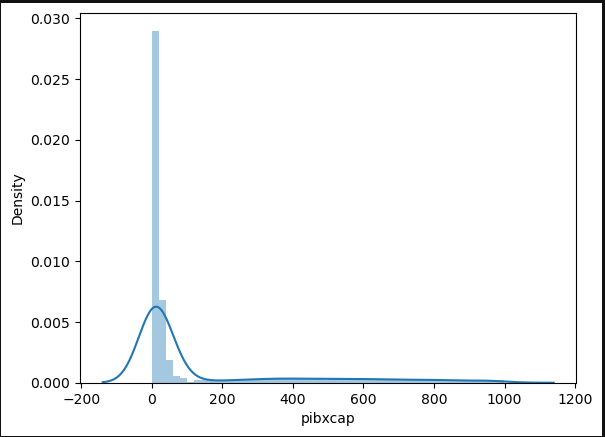

Aplicamos logaritmo pero aun así quedan bastantes nulos en la distribución. Como creo que es interesante conservarlos para no despreciar aquellos países que tienen un alto PIB per cápita no los dropearemos.\
 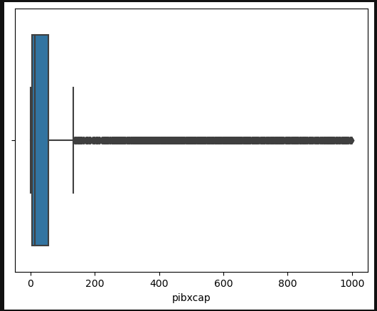


La distriución de la variable **Corrupción** queda bastante enmedio. Entiendo que es debido a la cantidad de nulos que se han imputado en esta variable:\
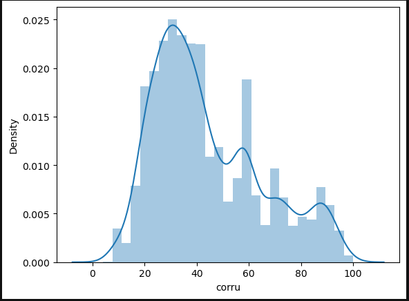\
Dejaremos la variable así.

Para la variable **Suicidios** aplicamos un SQRT en este caso porque la distribución queda más céntrica con este método:\
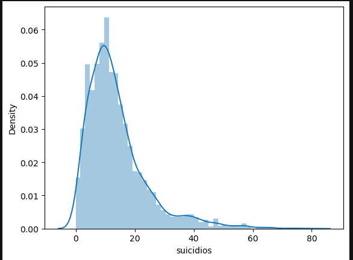

os quedan unos outliers pero también los dejaremos:\
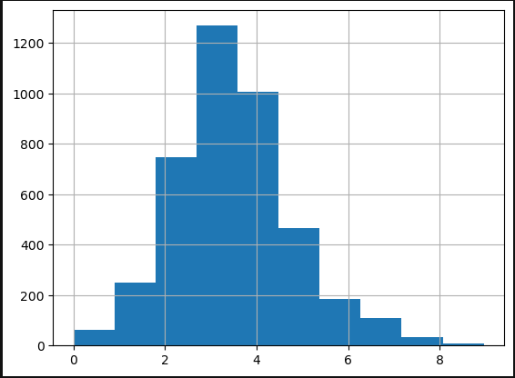


Para la variable **Homicidios** misma metodología que para suicidios:\
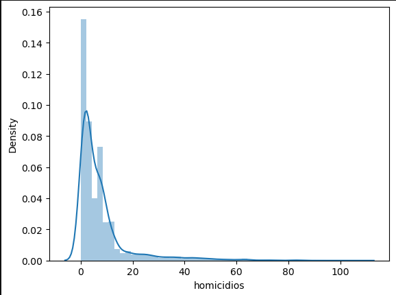


También tenemos algunos outliers pero los dejamos:\
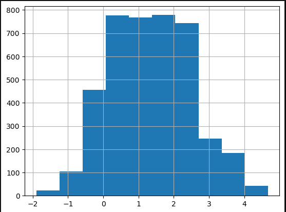

Por último, la variable **Natalidad** tiene una distribución bastante centrica y sin outliers por lo que no la tocamos:\
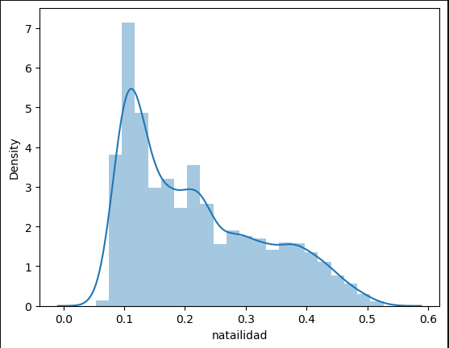


# Correlaciones
Con los cambios aplicados a las varibales, representamos la matriz de correlaciones otra vez:\
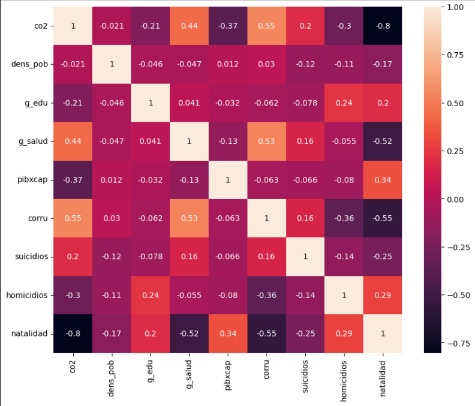\
Las variables CO2 y Natalidad parecen tener una correlación alta entre ellas, aunque haciendo el modelo de estas dos variables, parece que entre ellas no se explican tanto. 
Las dejamos como están:\
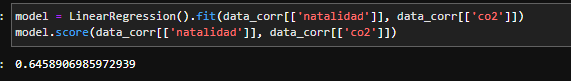

# Resultados:
Con todo esto entrenamos nuestro modelo y estudiamos el output:\
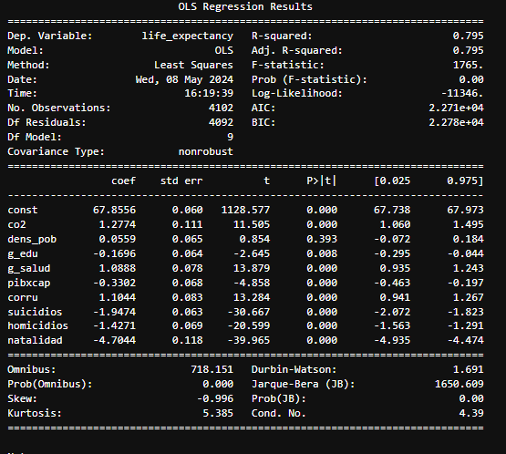

Aquí tengo que admitir que de todas las maneras que he probado, este es, para mi, el más consistente. 
Con un R2 de 0.795, casi todas las variables que hemos añadido al modelo son representativas a excepción de la densidad de población y el gasto en educación (aunque el Pvalor es bastante bajo).


En términos generales, la variable que mayor afecto tiene sobre la esperanza de vida es la natailidad, efectando negativamente a nuestra variable dependiente.

Algo que me sorprende observar es que la variable CO2 afecta positivamente a la variable dependiente, por lo que países con el mayor nivel de CO2 tenderán a tener una mayor esperanza de vida. Supongo que puede venir dado porque aquellos países que más CO2 generan también son los que más desarrollados están. 

Para la corrupción, debemos tener en cuenta que un nivel de corrupción 0 indica que la corrupción es elevada, por lo que, que esta variable tenga un efecto negativo sobre nuestra variable dependiente tiene sentido, pues cuanto más aumenta el nivel de corrupción, mayor es la esperanza de vida. 

En resumen: 
Las variables que afectan **positivamente** a la esperanza de vida en orden de relevancia son:
- el nivel de CO2 per cápita
- El indice de corrupción
- El gasto en salud

Las variables que afectan **negativamente** a la esperanza de vida en orden de relevancia son: 
- La natalidad
- Los suicidios
- Los homicidios
- el PIB per cápita

El gasto en educación y la densidad de población no las tendremos en cuenta porque con el pvalor dado no son representativas.

Con estos valores, puede llegar a predecir el valor de la esperanza de vida con un mse de 14-15. Teniendo un rango entre 40 - 80 más o menos, considero que el error es "bueno"


